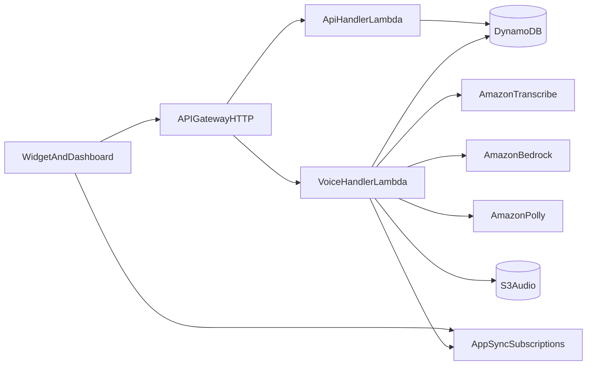

# Streammeo

**AI voice customer support** for your website: add a script tag or use the dashboard playground. Visitors tap a mic, speak in **English**, and get answers grounded in **your FAQs and tools**, with **session transcripts** for your team.

The voice pipeline is **100% AWS-native**: **Amazon Transcribe** for speech-to-text, **Amazon Bedrock** (Claude) for the LLM with tool use, and **Amazon Polly** for spoken replies. Realtime transcript/state updates ride **AppSync GraphQL subscriptions**; runtime data lives in **DynamoDB**.

**Auth:** email/password JWT by default; optional **Google sign-in** via Firebase (`POST /api/v1/auth/firebase-session`) when you configure Firebase on the server and the `VITE_FIREBASE_*` variables on the frontend.

---

The repo holds **two fully independent projects** that share nothing but the root `.env`:

| Project | Role | Deploy |
| ------- | ---- | ------ |
| **`backend/`** | Express REST (auth + workspace) and the voice pipeline (Transcribe → Bedrock → Polly), plus the embeddable widget bundle and the AWS CDK app. Its own dependencies and lockfile. | **AWS CDK** |
| **`frontend/`** | Support console: login/register, analytics, sessions, agent settings, FAQ editor, widget playground. Its own dependencies and lockfile. | **Vercel** |

Inside **`backend/`**:

| Piece | Role |
| ----- | ---- |
| **`backend/src`** | Express REST + voice pipeline. Runs as two AWS Lambdas in production; one combined Express server for local dev. |
| **`backend/widget`** | Single-file embeddable bundle (`dist/widget.js`): Shadow DOM UI, 16 kHz PCM capture, energy-based VAD, HTTP turn upload, AppSync subscriptions, S3 audio playback. Hosted on **CloudFront**. |
| **`backend/packages/db`** | Data access layer (`StreammeoStore`) backed by DynamoDB tables. |
| **`backend/packages/shared`** | Shared helpers (e.g. usage-cap check for optional minute limits). |
| **`backend/infrastructure`** | One AWS CDK stack: DynamoDB, S3, AppSync, API Gateway (HTTP), Lambdas, CloudWatch, and a **CloudFront + S3** CDN for the widget. |

---

## Tech stack

- **Runtime:** Node.js 20+, npm workspaces
- **Voice / LLM:** Amazon Transcribe (STT) · Amazon Bedrock / Claude (LLM + tools) · Amazon Polly (TTS)
- **Cloud / Infra:** AWS CDK — API Gateway (HTTP), AppSync, Lambda, DynamoDB, S3, CloudWatch — **ap-south-1**
- **Data:** DynamoDB tables (`users`, `workspaces`, `sessions`, `messages`, `tool_calls`, `faqs`)

---

## Architecture



**Voice turn:** the widget creates a session (`POST /api/v1/voice/session`), subscribes to AppSync, records one utterance as 16 kHz mono PCM, and uploads it (`POST /api/v1/voice/turn`). The voice Lambda runs Transcribe → Bedrock (with `search_faq` / `get_order_status` tools) → Polly, stores the MP3 in S3, publishes transcript + state to AppSync, and returns the result.

---

## Prerequisites

- **Node.js** ≥ 20 and **npm**
- AWS credentials (default region `ap-south-1`)
- **Bedrock model access** enabled for your `BEDROCK_MODEL_ID` (Bedrock console → Model access)

---

## Repository layout

```
streammeo/
├── .env                    # the ONLY file shared by both projects
├── .env.example
├── README.md
├── backend/                # independent project → deploys via AWS CDK
│   ├── package.json        # own deps + lockfile (internal workspaces: packages/*, widget)
│   ├── tsconfig.base.json · tsconfig.json
│   ├── src/                # Express + Lambda handlers (Transcribe/Bedrock/Polly)
│   ├── packages/
│   │   ├── db/             # DynamoDB-backed store + scripts/seed.ts
│   │   └── shared/
│   ├── widget/             # esbuild → dist/widget.js (hosted on CloudFront)
│   ├── infrastructure/     # AWS CDK app (one stack incl. widget CDN)
│   ├── Dockerfile · docker-compose.yml
└── frontend/               # independent project → deploys to Vercel
    ├── package.json        # own deps + lockfile
    ├── vite.config.ts · vercel.json · index.html
    ├── src/ · public/
    └── Dockerfile
```

> **Independence:** `backend/` and `frontend/` install, build, lint and deploy on
> their own — there is no root `package.json` and no shared `node_modules`. The
> only shared artifact is the root `.env`.

---

## Install & run locally

Both projects read the **single root `.env`**. Copy it once:

```bash
cp .env.example .env
```

Edit `.env`: set `AWS_REGION=ap-south-1`, valid AWS credentials (the local server calls real Bedrock/Transcribe/Polly/S3/DynamoDB), `AUDIO_BUCKET`, table names, a long `JWT_SECRET`, and the `VITE_*` vars used by the frontend.

Install + run each project independently (separate terminals):

```bash
# Backend — Express API + voice endpoints on http://localhost:3001
cd backend && npm install && npm run dev

# Frontend — dashboard on http://localhost:5173 (proxies /api/v1 → 3001)
cd frontend && npm install && npm run dev
```

Open `http://localhost:5173`, register or sign in, then copy the workspace API key from Settings for widget testing.

### Seed test data (destructive)

```bash
cd backend && npm run db:seed   # wipes configured DynamoDB tables, inserts test users + samples
```

Override the seeded password: `SEED_TEST_PASSWORD='your-secret' npm run db:seed`.

---

## Environment variables (backend `.env`)

| Variable | Required | Purpose |
| -------- | -------- | ------- |
| `AWS_REGION` | Yes | AWS region for every service (default `ap-south-1`). |
| `BEDROCK_MODEL_ID` | Yes | Bedrock model / inference-profile id (ap-south-1 uses `apac.` profiles). |
| `TRANSCRIBE_LANGUAGE_CODE` | No | BCP-47 STT language (default `en-US`). |
| `POLLY_VOICE_ID` / `POLLY_ENGINE` | No | Polly voice (default `Joanna`) and engine (default `neural`). |
| `AUDIO_BUCKET` | Yes | S3 bucket for synthesized audio (CDK output `AudioBucketName`). |
| `DYNAMODB_*_TABLE` | Yes | DynamoDB table names (CDK outputs). |
| `DYNAMODB_ENDPOINT` | No | Local Dynamo endpoint for offline testing. |
| `APPSYNC_GRAPHQL_URL` / `APPSYNC_API_KEY` | Yes (realtime) | AppSync endpoint + key (CDK outputs) used to publish events. |
| `JWT_SECRET` | Yes | Min. 16 characters; signs dashboard JWTs. |
| `FRONTEND_URL` | Yes | Dashboard origin for CORS. |
| `WIDGET_ALLOWED_ORIGINS` | No | `*` or comma-separated origins for widget CORS. |
| `FIREBASE_SERVICE_ACCOUNT_JSON` | No | Firebase service account JSON to enable Google sign-in. |
| `PORT` | No | Local dev API port (default `3001`). |

**Frontend (`VITE_*`, in the same root `.env`):** `VITE_API_URL` (API Gateway origin, no `/api/v1` suffix), `VITE_APPSYNC_GRAPHQL_URL`, `VITE_APPSYNC_API_KEY`, `VITE_WIDGET_URL` (CloudFront `WidgetCdnUrl`), optional `VITE_FIREBASE_*`. On Vercel these are set in Project → Settings → Environment Variables.

---

## Deploy

### Backend (AWS CDK — one stack, ap-south-1)

Everything runs from the `backend/` project:

```bash
cd backend
npm install
npm run infra:install
npm run infra:bootstrap   # first time per account/region
JWT_SECRET=<32+ chars> FRONTEND_URL=https://<your>.vercel.app npm run infra:deploy
```

`infra:deploy` builds the widget bundle first, then deploys the stack (the CDN
construct uploads `widget/dist/widget.js` to S3 and invalidates CloudFront).

Outputs (`backend/infrastructure/cdk-outputs.json`): `HttpApiUrl`, `GraphqlApiUrl`, `GraphqlApiKey`, `*TableName`, `AudioBucketName`, **`WidgetCdnUrl`**. Tear down with `npm run infra:destroy`.

### Frontend (Vercel)

Import **only the `frontend/` directory** as the Vercel project (set Root Directory = `frontend`). `frontend/vercel.json` sets the install (`npm ci`), build (`npm run build`), output (`dist`), and SPA rewrites.

Set Vercel env vars to the CDK outputs:

| Name | Value |
| ---- | ----- |
| `VITE_API_URL` | `HttpApiUrl` (no trailing slash) |
| `VITE_APPSYNC_GRAPHQL_URL` | `GraphqlApiUrl` |
| `VITE_APPSYNC_API_KEY` | `GraphqlApiKey` |
| `VITE_WIDGET_URL` | `WidgetCdnUrl` (CloudFront widget URL) |
| `VITE_FIREBASE_*` | Only for Google sign-in |

---

## Embedding the widget

The widget is built in `backend/widget` and hosted on CloudFront by the CDK
stack — `npm run infra:deploy` builds and uploads it for you. The `WidgetCdnUrl`
output is the `<script src>` to embed:

```html
<script
  src="https://<dist-id>.cloudfront.net/widget.js"
  data-api-key="YOUR_WORKSPACE_API_KEY"
  data-backend-url="https://<api-id>.execute-api.ap-south-1.amazonaws.com"
  data-appsync-url="https://<id>.appsync-api.ap-south-1.amazonaws.com/graphql"
  data-appsync-api-key="da2-..."
  async
></script>
```

To build the bundle by hand (e.g. for local testing): `cd backend && npm run widget:build` (output: `backend/widget/dist/widget.js`).

| Attribute | Description |
| --------- | ----------- |
| `data-api-key` | **Required.** Workspace API key from the dashboard. |
| `data-backend-url` | **Required in production.** API Gateway origin. |
| `data-appsync-url` / `data-appsync-api-key` | Optional. Enable AppSync realtime transcript/state. |

The widget uses a **Shadow DOM** so host-page CSS does not clash with the mic + transcript UI.

---

## Scripts

Run inside the relevant project directory.

**`backend/`**

| Command | Description |
| ------- | ----------- |
| `npm install` | Install backend deps (incl. internal `packages/*` + `widget`). |
| `npm run dev` | Express API + voice endpoints on `http://localhost:3001`. |
| `npm run build` / `npm run lint` | Typecheck the backend. |
| `npm run widget:build` / `widget:dev` | Build / watch `widget/dist/widget.js`. |
| `npm run db:seed` | **Wipes DynamoDB rows** and inserts test data. |
| `npm run infra:install` / `:bootstrap` / `:synth` / `:deploy` / `:destroy` | CDK lifecycle (`:synth`/`:deploy` build the widget first). |

**`frontend/`**

| Command | Description |
| ------- | ----------- |
| `npm install` | Install frontend deps. |
| `npm run dev` | Dashboard on `http://localhost:5173` (proxies `/api/v1` to 3001). |
| `npm run build` | Type-check + Vite production build to `dist/`. |
| `npm run lint` | ESLint. |

---

## LLM tools (backend)

| Tool | Behavior |
| ---- | -------- |
| `get_order_status` | Order lookup — Shopify-backed if workspace keys are set, else mock. |
| `search_faq` | Keyword-style search over workspace FAQ documents. |

---

## Data model (DynamoDB)

All tables are on-demand (`PAY_PER_REQUEST`) with point-in-time recovery; prod also enables deletion protection. Child collections use native composite keys instead of synthetic `parent::child` ids, so a list is a single base-table query and write amplification stays low.

| Table | Partition key | Sort key | GSIs |
| ----- | ------------- | -------- | ---- |
| `users` | `id` | — | `EmailIndex` (email), `FirebaseUidIndex` (firebaseUid) |
| `workspaces` | `id` | — | `ApiKeyIndex` (apiKey), `OwnerIndex` (ownerId, createdAt) |
| `sessions` | `id` | — | `WorkspaceStartedAtIndex` (workspaceId, startedAt) |
| `messages` | `sessionId` | `sk` = `createdAt#messageId` | `WorkspaceCreatedAtIndex` (workspaceId, createdAt) |
| `tool_calls` | `sessionId` | `sk` = `createdAt#toolCallId` | none |
| `faqs` | `workspaceId` | `faqId` | `WorkspaceCreatedAtIndex` (workspaceId, createdAt) |

---

## Security notes

- Use a strong `JWT_SECRET` in production.
- Restrict `WIDGET_ALLOWED_ORIGINS` to real store domains when you go live.
- Treat `FIREBASE_SERVICE_ACCOUNT_JSON` like a private key; use a secrets manager in production.
- The S3 audio bucket is private; the widget plays audio via short-lived presigned URLs.
